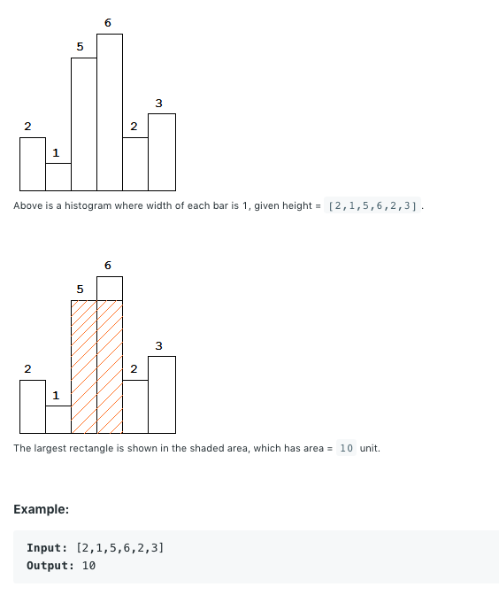

[题目介绍](https://leetcode.com/problems/largest-rectangle-in-histogram/)

Given n non-negative integers representing the histogram's bar height where the width of each bar is 1, find the area of largest rectangle in the histogram.




## 方法1:暴力统计

1、统计所有的高度

2、对于某个高度h，遍历不小于该高度的连续柱子数量为n，则面积为h*n,与最大面积比较并赋值

3、返回最大面积。

代码如下：时间复杂度O(n^2),空间复杂度O(n)

```c++
class Solution {
public:
    int largestRectangleArea(vector<int>& heights) {
        set<int> heightSize;
        for(int i = 0; i< heights.size();i++){
            heightSize.insert(heights[i]);
        }
        int result = 0;
        for(set<int>::iterator it = heightSize.begin(); it != heightSize.end(); it++){
            int height = *it;
            int width = 0;
            for(int i = 0; i< heights.size(); i++){
                if(heights[i] >= height){
                    width++;
                } else {
                    result = std::max(result, width * height);
                    width = 0;
                }
            }
            result = std::max(result, width * height);
        }
        return result;
        
    }
};
```


## 方法2:单调栈

参考大神的思路，使用[单调递增栈](https://github.com/zjuwispersure/Leetcoding/blob/master/MonotoneStack.md)。


```C++
class Solution {
public:
    int largestRectangleArea(vector<int>& heights) {
        stack<int> indexs;
        int maxArea = 0;
        heights.push_back(0);
        for(int i = 0; i < heights.size(); i++){
            while(!indexs.empty() && heights[indexs.top()] > heights[i]){
                int h = heights[indexs.top()];
                indexs.pop();
                int index = indexs.empty()? -1:indexs.top();
                maxArea = std::max(maxArea, h *(i - index - 1));
                
            }
            indexs.push(i);
        }
        return maxArea;
        
    }
};
```


